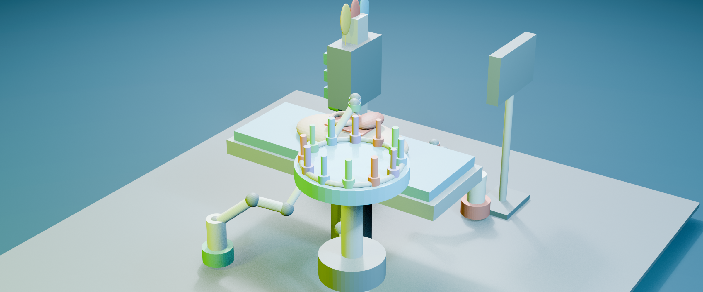
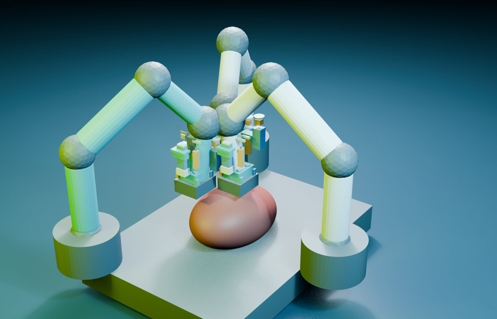
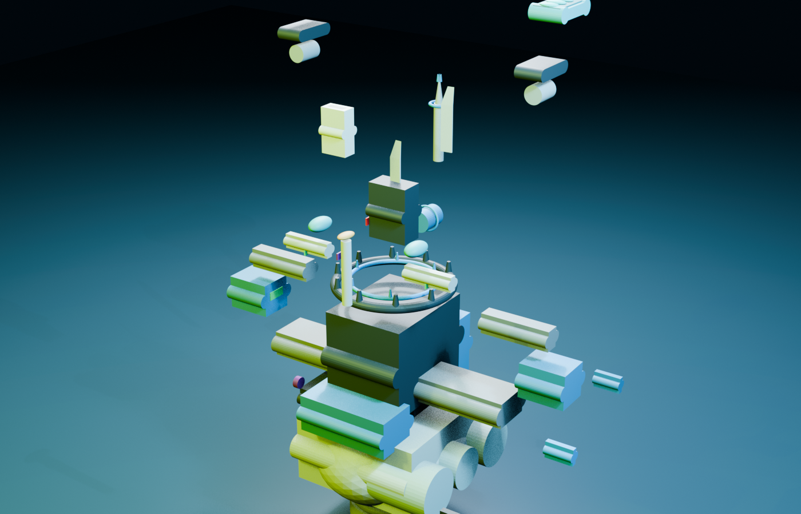
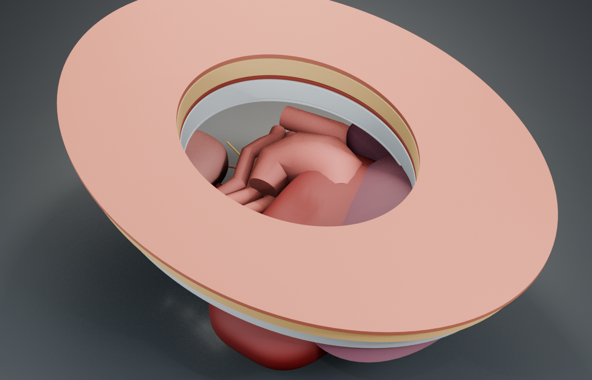
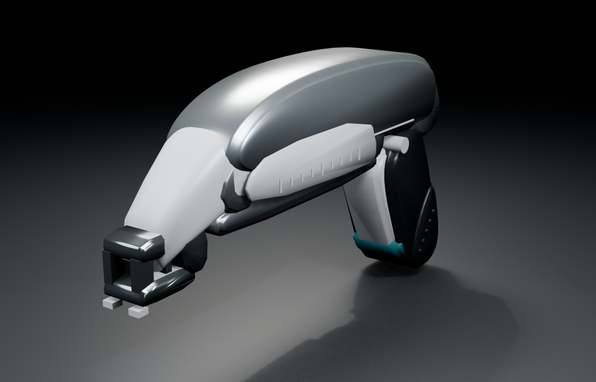
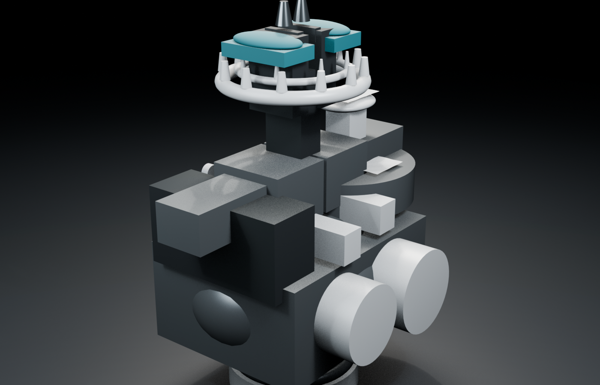
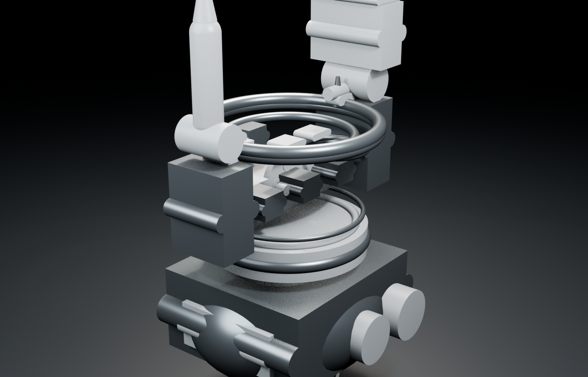
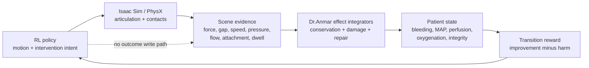

# Dr.Anmar Assets

**Simulation-ready surgical robotics assets and contact-driven patient effects
for NVIDIA Isaac Sim and Isaac Lab.**

[](docs/RESEARCH_BOUNDARIES.md)
[](https://openusd.org/)
[](NOTICE.md)

<p align="center">
  
</p>

<p align="center">
  <em>Autonomous Rescue OR — multi-arm intervention, tool exchange, patient
  state, resuscitation, and monitoring in one composable research scene.</em>
</p>

Dr.Anmar Assets is the standalone simulation substrate behind Dr.Anmar's
surgical autonomy research. It combines OpenUSD instruments, robots, patients,
operating-room scenes, interaction frames, and Isaac Lab adapters with
patient-effect models whose state can only advance from measured post-physics
evidence.

The central design rule is simple:

> A policy may request an intervention. It may not write the result.

Bleeding control, perfusion, repair integrity, fluid delivery, ventilation,
damage, and rescue reward are derived from contact forces, geometry,
attachments, flow, pressure, inventory, dwell, and patient state. This places
the learning signal downstream of the physical interaction instead of behind a
success flag an agent can exploit.

## Built as a complete surgical research surface

| Procedure-scale systems | Mechanism and patient detail |
| --- | --- |
| [](data/Props/SurgicalOncology/OncoSurgeryCell) | [](data/Props/SurgicalDissection/SafePlaneDissectionRobot) |
| **Oncologic resection cell** — three coordinated arms, multimodal sensing, margin-aware tissue state, and specimen handling. | **SafePlane dissection** — an exploded view of interchangeable traction, hydro, blunt, scissors, sensing, and protected-structure components. |
| [](data/Props/Patients/DynamicAbdominalPatient) | [](data/Props/SurgicalClosure/SkinStapler) |
| **Dynamic abdominal patient** — layered wall mechanics, open-abdomen access, organs, vessels, pathology, respiration, and physiology. | **Articulated skin stapler** — trigger, pusher, magazine state, placement frames, and deployable staple representation. |
| [](data/Props/SurgicalHemostasis/AdaptiveHemostasisRobot) | [](data/Props/SurgicalAssessment/PerfusionViabilityRobot) |
| **Adaptive hemostasis** — compression, clip, patch, suction, irrigation, and verification modes under one contact-owned effect model. | **Perfusion viability** — RGB, ICG/NIR, speckle, thermal, oxygenation, ultrasound, and Doppler sensing surfaces. |

See the [visual showcase](docs/SHOWCASE.md) for full-resolution views and
physical-state inspection assets.

## Research highlights

- **Autonomous Rescue OR** — a multi-station rescue environment with
  complication detection, resource accounting, tool changes, resuscitation,
  ventilation, and transition-based reward.
- **Dynamic abdominal patient** — layered OpenUSD anatomy, scenario variants,
  deformable wound margins, patient physiology, and contact-coupled tissue
  response.
- **Procedure-specific instruments** — exposure, wound preparation,
  hemostasis, dissection, seal-and-divide, anastomosis, perfusion assessment,
  oncologic resection, closure, and surgical count assets.
- **Dependency-complete assets** — primary layers ship with their local
  geometry, materials, textures, interaction frames, physics profiles, and
  manifests.
- **Isaac Lab adapters** — configuration and runtime helpers for Franka,
  dVRK PSM/ECM, STAR, rigid, articulated, particle, and deformable scenes.
- **Imitation-learning contract** — transition-aligned robot, contact, vessel,
  vital-sign, and fluid-balance observations with patient effects excluded
  from the action space and dataset splits kept at complete-episode boundaries.

## Contact-driven effect architecture



See [Contact-driven effects](docs/CONTACT_DRIVEN_EFFECTS.md) for the authority
boundary and the patient coupling implemented today.

## Catalog

| Family | Representative assets | Catalog path |
| --- | --- | --- |
| Rescue environment | Autonomous Rescue OR, deformable rescue vessel, resuscitation module | `data/Environments/SurgicalAutonomy/AutonomousRescueOR` |
| Patient | Dynamic abdominal patient, layered laparotomy anatomy | `data/Props/Patients/DynamicAbdominalPatient` |
| Exposure and preparation | Atraumatic exposure, wound preparation | `data/Props/SurgicalExposure`, `data/Props/SurgicalPreparation` |
| Hemostasis and dissection | Adaptive hemostasis, SafePlane dissection | `data/Props/SurgicalHemostasis`, `data/Props/SurgicalDissection` |
| Division and reconstruction | Adaptive seal/divide, adaptive anastomosis | `data/Props/SurgicalDivision`, `data/Props/SurgicalReconstruction` |
| Assessment and oncology | Perfusion viability, OncoSurgery cell | `data/Props/SurgicalAssessment`, `data/Props/SurgicalOncology` |
| Closure and count | Skin stapler, adhesive, needle/thread, closure robot, sponge | `data/Props/SurgicalClosure`, `data/Props/SurgicalCount` |
| Robot foundations | dVRK PSM/ECM and STAR | `data/Robots` |

The detailed inventory is in [Asset catalog](docs/ASSET_CATALOG.md).

## Quick start

Clone the complete repository so every USD layer keeps its relative
dependencies:

```bash
git clone https://github.com/Numi2/dr-assets.git
cd dr-assets
```

Use it as an editable package from an Isaac Lab Python environment:

```bash
python -m pip install -e .
```

Or add the checkout as a Kit extension folder. The repository root is the
extension root and contains `config/extension.toml`.

```bash
./isaaclab.sh -p your_script.py \
  --ext-folder /absolute/path/to/dr-assets
```

Resolve a catalog asset in Python:

```python
from orbit.surgical.assets import asset_path

rescue_or = asset_path("autonomous_rescue_or")
hemostasis_tool = asset_path("adaptive_hemostasis")
```

The `orbit.surgical.assets` import namespace is retained for compatibility with
Dr.Anmar and ORBIT-Surgical-derived tasks. The distributable project name is
`dranmar-assets`.

For submodule integration, environment overrides, and Isaac for Healthcare
catalog interoperation, see [Integration](docs/INTEGRATION.md).

## What is calibrated—and what is not

The mechanics and patient-effect pathways are executable research code.
Parameter sets currently marked `provisional_engineering_seeds` are not
clinical calibration. Asset presence, a successful simulation run, or an RL
score does not establish biological fidelity.

The intended calibration path is measured contact/flow/pressure data →
identified parameter set → held-out physical validation. Until that work is
complete, this repository must not be described as patient-specific,
clinically validated, a medical device, or suitable for patient care.

Read the exact [research boundaries](docs/RESEARCH_BOUNDARIES.md).

## Project ownership and attribution

Dr.Anmar owns the patient-effect architecture, procedure assets, scene
composition, interaction contracts, and research integration in this
repository. The compatibility namespace and base dVRK/ECM/STAR configuration
are derived from ORBIT-Surgical and retain their BSD-3-Clause notices.
Dr.Anmar-authored modules and asset families carry Apache-2.0 notices.

NVIDIA Isaac Sim, Isaac Lab, PhysX, and Isaac for Healthcare are technical
foundations or interoperability targets; they are not bundled here, and this
repository does not imply NVIDIA endorsement. See [Provenance](docs/PROVENANCE.md)
and [Notices](NOTICE.md).

## Contributing and citing

Research contributions should improve physical observability, calibration,
patient coupling, or asset fidelity—not add policy-writable shortcuts. See
[CONTRIBUTING.md](CONTRIBUTING.md) and [CITATION.cff](CITATION.cff).
