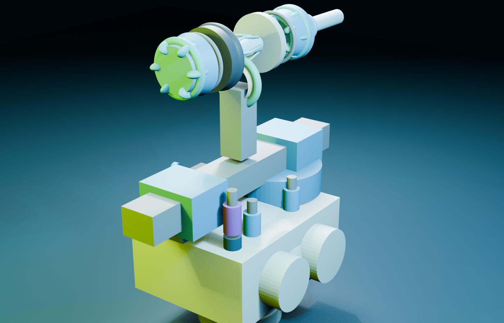
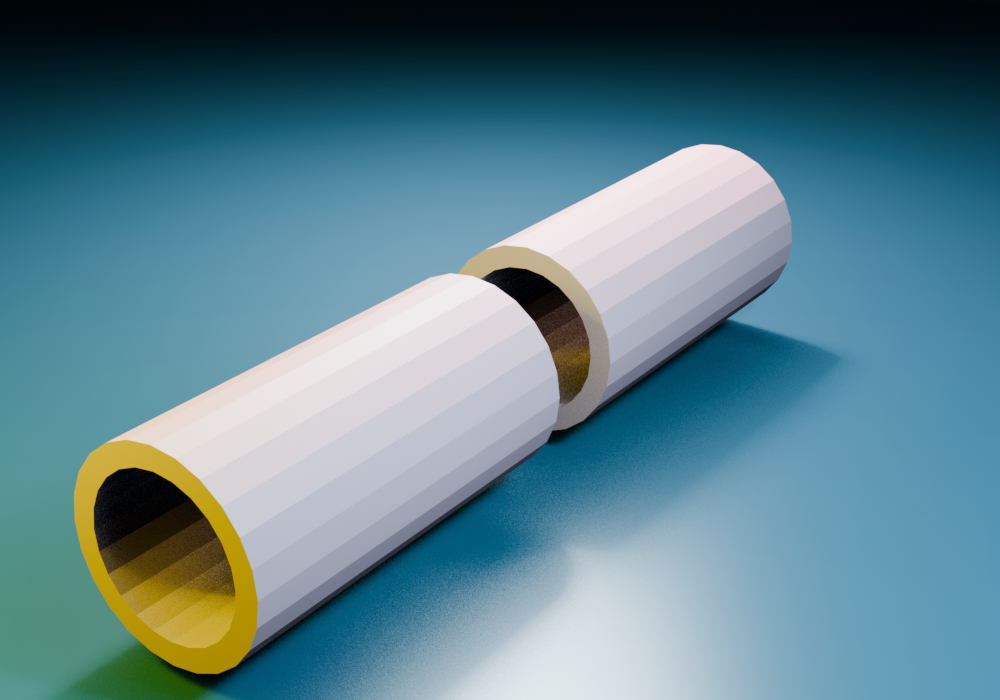
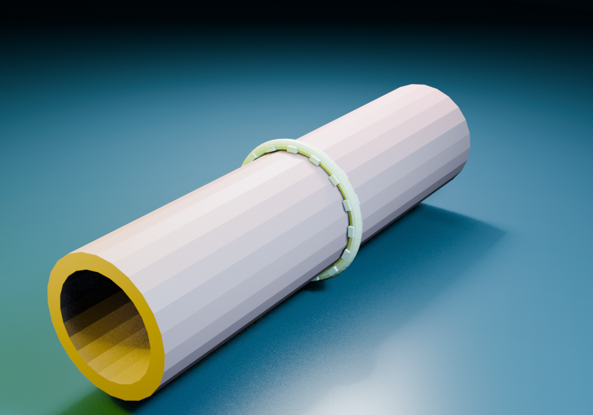

# Visual showcase

These are studio renders of the inspection GLBs shipped in this repository.
They show the actual asset geometry and authored states; they are not generated
concept art. OpenUSD composition and the Isaac runtime add articulation,
contacts, attachments, particles, deformables, sensors, and patient effects.

## Autonomous Rescue OR


The rescue environment composes the patient, intervention stations, sterile
tool carousel, physiological monitor, resuscitation module, and shared
workspace. The visual scene is paired with post-physics scene adapters and
patient-effect integrators rather than action-authored rescue outcomes.

## Procedure systems

| Oncologic resection | SafePlane dissection |
| --- | --- |
|  |  |
| Multi-arm sensing, resection, margin state, and specimen handling. | Interchangeable dissection, traction, hydro, energy, and sensing components. |

| Adaptive hemostasis | Adaptive anastomosis |
| --- | --- |
|  |  |
| Compression, clip, patch, suction, irrigation, and verification. | Alignment, approximation, staple formation, reinforcement, leak test, and patency. |

| Perfusion viability | Articulated skin stapler |
| --- | --- |
|  |  |
| Multimodal optical, thermal, ultrasound, and Doppler assessment surfaces. | Trigger, pusher, magazine, placement, and deployable-staple geometry. |

## Patient and repair states


The dynamic patient provides layered abdominal access, internal organs,
vasculature, nerves, scenario pathology, respiration states, and deformable
wound margins.

The following inspection assets expose state geometry used by the rescue
environment. Patient outcome is still computed from live contact, attachment,
flow, pressure, leak, dwell, and physiology evidence at runtime.

| Uncontrolled vessel | Compressed vessel | Retained repair |
| --- | --- | --- |
|  |  |  |

| Leaking bowel ends | Repaired anastomosis |
| --- | --- |
|  |  |

## Reproduce the views

The renderer fixes the simulation-to-GLB axis conversion at the imported scene
root and scales the studio lights by model area, avoiding the rotated and
overexposed previews that generic GLB viewers can produce.

```bash
blender --background --python tools/render_showcase.py
```

Render a single view:

```bash
DRANMAR_RENDER_ONLY=skin-stapler.png \
  blender --background --python tools/render_showcase.py
```

